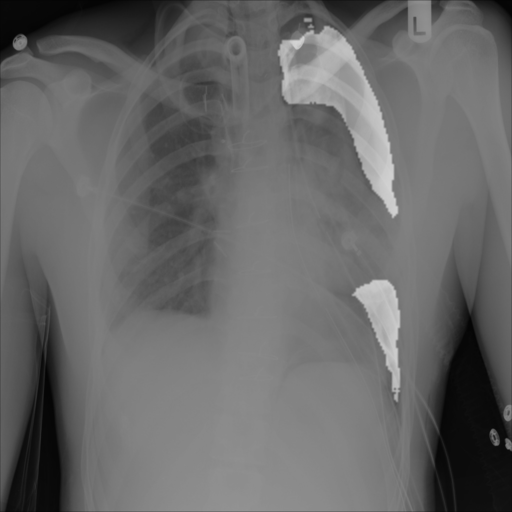

# AI Pneumothorax Segmentation
##  Medical image classification with Deep Neural Networks


This application uses a Deep Neural network to identify Pneumothorax.
It takes an Thorax x-ray as input, the resulting image will have the 
Pneumothorax zones hightlighted.

Using an example X ray image           ----------->            and the result will be:

     ------>        

This application can be found in: [Heroku](https://pneumot.herokuapp.com). You can test it with your own images!

The Deep Learning neural network module has been trained with images from the 
[SIIM-ACR Pneumothorax Segmentations](https://www.kaggle.com/vbookshelf/pneumothorax-chest-xray-images-and-masks)
from [kaggle](kaggle.com).
The software used is [PyTorch](https://pytorch.org/) with [fast.ai](https://www.fast.ai).

This repo is based in [fast.ai](https://github.com/render-examples/fastai-v3) and has been 
adapted to be used on Heroku.

You can test locally installing Docker and using the command:

```
docker build -t pneumo . && docker run --rm -it -p 5000:5000 pneumo
```


