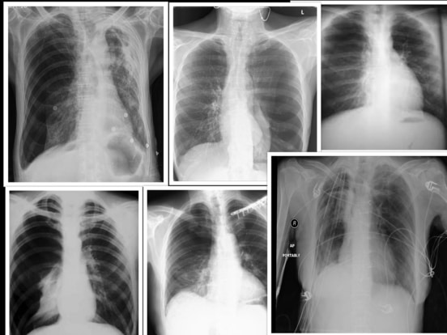
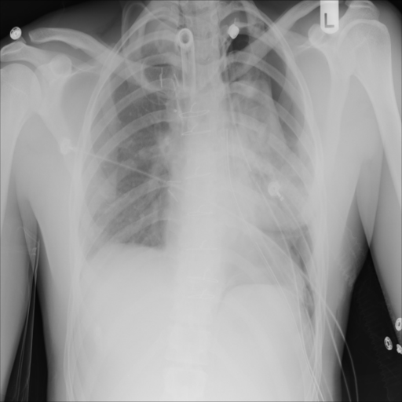

# Pneumothorax Segmentation
##  Medical image classification with [fast.ai](https://www.fast.ai) on [Heroku](https://www.heroku.com)


This repo is based in [fast.ai](https://github.com/render-examples/fastai-v3) model for Render and has been 
adapted to be used on Heroku.

The Deep Learning neural network module has been trained with the 
[SIIM-ACR Pneumothorax Segmentations](https://www.kaggle.com/vbookshelf/pneumothorax-chest-xray-images-and-masks)
from [kaggle](kaggle.com).

Simply load a chest X ray image like



and the result will be:


This application can be found in: [Heroku](https://pneumot.herokuapp.com). You can test it with your own images!

You can test locally installing Docker and using the command:

```
docker build -t pneumo . && docker run --rm -it -p 5000:5000 pneumo
```

You can find the Render deployment guide in https://course.fast.ai/deployment_render.html.

Please use [Render thread inside fast.ai forum](https://forums.fast.ai/t/deployment-platform-render/33953) for questions and support.


